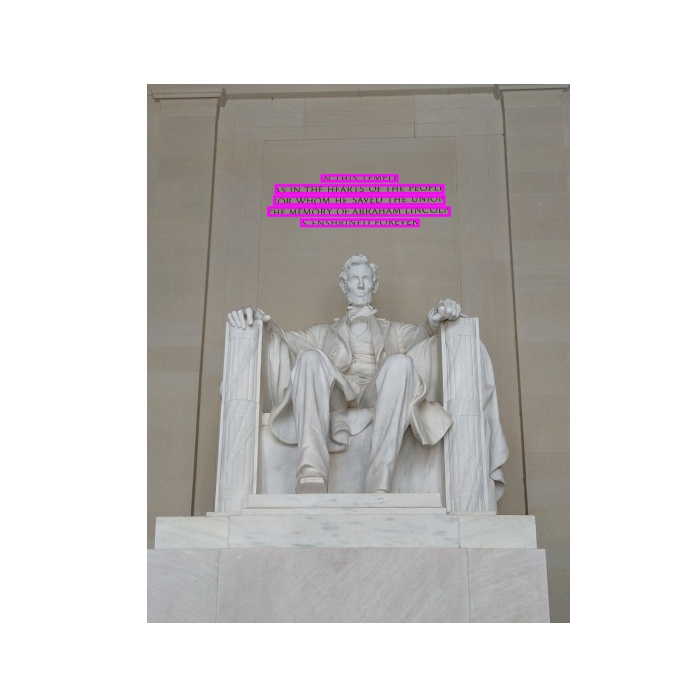
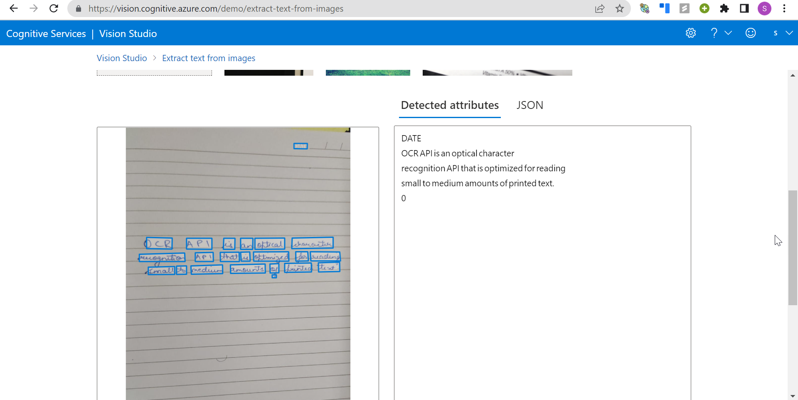

# Intro to Extracting Text in Images and Documents using Computer Vision

## Module Source Link

https://docs.microsoft.com/en-us/learn/modules/read-text-images-documents-with-computer-vision-service/

## Goals

In this workshop, we will discuss *Extract Text in Images and Documents using Computer Vision*.

| **Goal**              | *describe the goal of the workshop*                                    |
| ----------------------------- | --------------------------------------------------------------------- |
| **What will you learn**       | How to Extract in Images and Documents using OCR and Read API                                        |
| **What you'll need**          | Custom Vision(https://www.customvision.ai/) 
| **Duration**                  | 60-90 minutes                                                              |
| **Microsoft Cloud Topics taught**                  | Azure, Custom Vision, Visual Studio Code                                                                |
| **Just want to try the app or see the solution?** | [Solution](https://github.com/SHAIMA-HAQUE/Intro-to-Extracting-Text-in-Images-and-Documents-using-Computer-Vision/tree/main/workshop/solution/Read_Text_from_Images_complete/ocr)                         |
| **Slides** | [Powerpoint](slides.pptx) 
                         
## Video

Embed your Train the Trainer video here. Instructions on how to create a great video experience is [available on this page](../video-guidance.md).

## Pre-Learning

- Basic Knowledge of [Python](https://docs.microsoft.com/en-us/learn/modules/intro-to-python/)

- Basic Knowledge of [APIs](https://www.freecodecamp.org/news/what-is-an-api-in-english-please-b880a3214a82/)


## Prerequisites

- An [Azure Account](https://azure-for-academics.github.io/getting-azure/). You may get free credits from [Azure for Students](https://azure.microsoft.com/free/students/), or [Azure Free Trial](https://azure.microsoft.com/free/).

- Python 3.6 or later installed.

- Visual Studio Code.


## What students will learn

Have you ever wanted to scan handwritten documents and convert it to text? Your college notes maybe? In this workshop you will learn to do just that. We will extract text from images and documents using OCR and Read API. 
Running code in terminal: https://www.youtube.com/watch?v=0uQhHrlKe7c&t=4s
 


[Learn module area](https://microsoftlearning.github.io/AI-102-AIEngineer/Instructions/20-ocr.html)

## Milestone 1

**Creating your first Cognitive Service Resource**

1. Open the [Azure portal](https://portal.azure.com), sign in using your Microsoft account which is associated with Azure subscription.

2. Select the **+Create Resource button**, search for Cognitive Services and create a Cognitive Services Resource.

   **Subscription:** Your Azure subscription

   **Resource group:** Choose or create a resource group (if you are using a restricted subscription, you may not have permission to create a new resource group -      use the one provided)

   **Region:** Choose any available region

   **Name:** Enter a unique name

   **Pricing tier:** Standard S0


3. Click on **Review+Create** and wait for its deployment.

4. When the resource has been deployed, go to it and view its Keys and Endpoint page. You will need the endpoint and one of the keys from this page in the next procedure.


## Milestone 2

**Prepare to use Computer Vision SDK**

1. Clone the repository: https://github.com/SHAIMA-HAQUE/Intro-to-Extracting-Text-in-Images-and-Documents-using-Computer-Vision
   (The code in this repo is taken from https://github.com/MicrosoftLearning/AI-102-AIEngineer)
2. Navigate to **workshop/Read_Text_from_Images_initial/ocr/read-text**
3. We need to install the Computer Vision SDK package by running the command:
   ```
   pip install azure-cognitiveservices-vision-computervision==0.7.0
   ```
4. Open **read-text.py** file in your text editor.
5. Add the lines below to import the namespaces you will need to use the Computer Vision SDK.
   ```
   from azure.cognitiveservices.vision.computervision import ComputerVisionClient ​

   from azure.cognitiveservices.vision.computervision.models import OperationStatusCodes ​

   from msrest.authentication import CognitiveServicesCredentials
   ```
6. In the code file for your client application, in the Main function, note that the code to load the configuration settings has been provided. Then find the      comment Authenticate Computer Vision client. Then, under this comment, add the following language-specific code to create and authenticate a Computer Vision client object:
   ```
   credential = CognitiveServicesCredentials(cog_key) 

   cv_client = ComputerVisionClient(cog_endpoint, credential)
   ```

## Milestone 3

**Using the OCR API and Read API using Vision Studio**
Just to give them a sneak peek into the result of the code we are about to write
1. Sign in through your azure account. Choose your resource and upload an image which has text on it or choose one from the options given.



## Milestone 4

**OCR Code**
```
def GetTextOcr(image_file):
    print('Reading text in {}\n'.format(image_file))
    with open(image_file, mode="rb") as image_data:
        ocr_results = cv_client.recognize_printed_text_in_stream(image_data)
    # Prepare image for drawing
    fig = plt.figure(figsize=(7, 7))
    img = Image.open(image_file)
    draw = ImageDraw.Draw(img)

    # Process the text line by line
    for region in ocr_results.regions:
        for line in region.lines:

            # Show the position of the line of text
            l,t,w,h = list(map(int, line.bounding_box.split(',')))
            draw.rectangle(((l,t), (l+w, t+h)), outline='magenta', width=5)

            # Read the words in the line of text
            line_text = ''
            for word in line.words:
                line_text += word.text + ' '
            print(line_text.rstrip())

    # Save the image with the text locations highlighted
    plt.axis('off')
    plt.imshow(img)
    outputfile = 'ocr_results.jpg'
    fig.savefig(outputfile)
    print('Results saved in', outputfile)
```
We are using *matplotlib* and *pillow* to highlight the areas of text using magenta colored rectangles and displaying the output in the form of *ocr_results.jpg* and also displaying the text in the terminal.


## Milestone 5

**Read API Code**

```
def GetTextRead(image_file):
    print('Reading text in {}\n'.format(image_file))
    with open(image_file, mode="rb") as image_data:
        read_op = cv_client.read_in_stream(image_data, raw=True)

    # Get the async operation ID so we can check for the results
    operation_location = read_op.headers["Operation-Location"]
    operation_id = operation_location.split("/")[-1]

    # Wait for the asynchronous operation to complete
    while True:
        read_results = cv_client.get_read_result(operation_id)
        if read_results.status not in [OperationStatusCodes.running, OperationStatusCodes.not_started]:
            break
        time.sleep(1)

    # If the operation was successfuly, process the text line by line
    if read_results.status == OperationStatusCodes.succeeded:
        for page in read_results.analyze_result.read_results:
            for line in page.lines:
                print(line.text)

```
The Read API uses an asynchronous operation model, in which a request to start text recognition is submitted; and the operation ID returned from the request can subsequently be used to check progress and retrieve results.


## Quiz or Code Challenge

[Knowledge Check](https://docs.microsoft.com/en-us/learn/modules/read-text-images-documents-with-computer-vision-service/6-knowledge-check)

## Next steps

Microsoft Learning Path: Learn more about

[Custom Vision](https://docs.microsoft.com/en-us/learn/paths/explore-computer-vision-microsoft-azure/),

[Introduction to Computer Vision using Tensorflow](https://docs.microsoft.com/en-us/learn/modules/intro-computer-vision-tensorflow/)

[Introduction to Computer Vision using PyTorch](https://docs.microsoft.com/en-us/learn/modules/intro-computer-vision-pytorch/?ns-enrollment-type=learningpath&ns-enrollment-id=learn.pytorch.pytorch-fundamentals)


## Feedback

Be sure to give [feedback about this workshop](https://forms.office.com/r/MdhJWMZthR)!

[Code of Conduct](../CODE_OF_CONDUCT.md)

