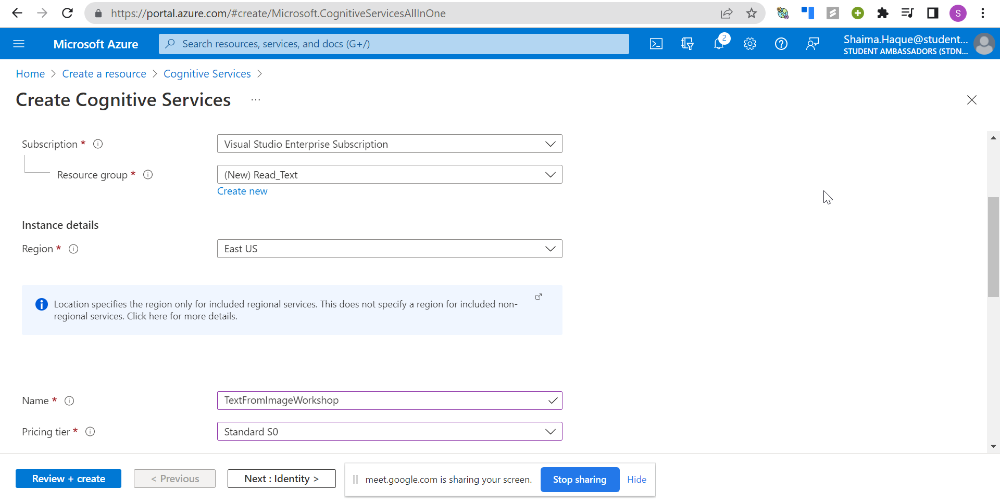
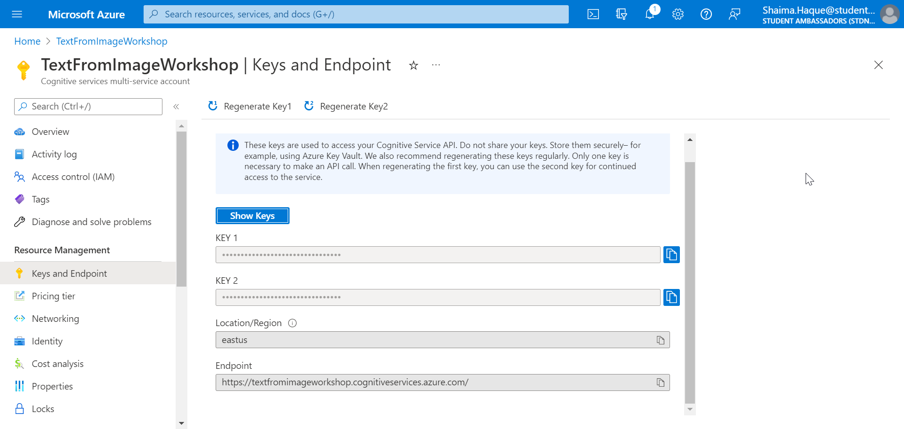

# Intro to Extracting Text in Images and Documents using Computer Vision

## Module Source Link

https://docs.microsoft.com/en-us/learn/modules/read-text-images-documents-with-computer-vision-service/

## Goals

In this workshop, we will discuss *insert your topic*.

| **Goal**              | *describe the goal of the workshop*                                    |
| ----------------------------- | --------------------------------------------------------------------- |
| **What will you learn**       | How to Extract in Images and Documents using OCR and Read API                                        |
| **What you'll need**          | Custom Vision(https://www.customvision.ai/) 
| **Duration**                  | 60-90 minutes                                                              |
| **Microsoft Cloud Topics taught**                  | Azure, Custom Vision, Visual Studio Code                                                                |
| **Just want to try the app or see the solution?** | [Solution](https://github.com/SHAIMA-HAQUE/Intro-to-Extracting-Text-in-Images-and-Documents-using-Computer-Vision/tree/main/workshop/solution/Read_Text_from_Images_complete/ocr)                         |
| **Slides** | [Powerpoint](slides.pptx) 
                         
## Video

Embed your Train the Trainer video here. Instructions on how to create a great video experience is [available on this page](../video-guidance.md).

## Pre-Learning

- Basic Knowledge of [Python](https://docs.microsoft.com/en-us/learn/modules/intro-to-python/)

- Basic Knowledge of [APIs](https://www.freecodecamp.org/news/what-is-an-api-in-english-please-b880a3214a82/)

## Prerequisites

- An [Azure Account](https://azure-for-academics.github.io/getting-azure/). You may get free credits from [Azure for Students](https://azure.microsoft.com/free/students/), or [Azure Free Trial](https://azure.microsoft.com/free/).

- Python 3.6 or later installed.

- Visual Studio Code.

## What students will learn

Have you ever wanted to scan handwritten documents and convert it to text? Your college notes maybe? In this workshop you will learn to do just that. We will extract text from images and documents using OCR and Read API. 

 //to be done

## Milestone 1 (example)

**Creating your first Cognitive Service Resource**

1. Open the [Azure portal](https://portal.azure.com), sign in using your Microsoft account which is associated with Azure subscription.

2. Select the **+Create Resource button**, search for Cognitive Services and create a Cognitive Services Resource.

   **Subscription:** Your Azure subscription

   **Resource group:** Choose or create a resource group (if you are using a restricted subscription, you may not have permission to create a new resource group -      use the one provided)

   **Region:** Choose any available region

   **Name:** Enter a unique name

   **Pricing tier:** Standard S0

[Learn module area](https://microsoftlearning.github.io/AI-102-AIEngineer/Instructions/20-ocr.html)

3. Click on **Review+Create** and wait for its deployment.

4. When the resource has been deployed, go to it and view its Keys and Endpoint page. You will need the endpoint and one of the keys from this page in the next procedure.

## Milestone 2

text

link

## Milestone 3

text

link

## Milestone 4

text

link

## Milestone 5

text

link

## Quiz or Code Challenge

Link to quiz or challenge on Learn

## Next steps

*links to Microsoft Learn to further learning progress, and/or a path to certifications*

## Practice

*suggest, or add as an addendum, a way to extend students knowledge of the topic by creating a new app or demo that builds on the original workshop materials.*

## Feedback

Be sure to give [feedback about this workshop](https://forms.office.com/r/MdhJWMZthR)!

[Code of Conduct](../CODE_OF_CONDUCT.md)

